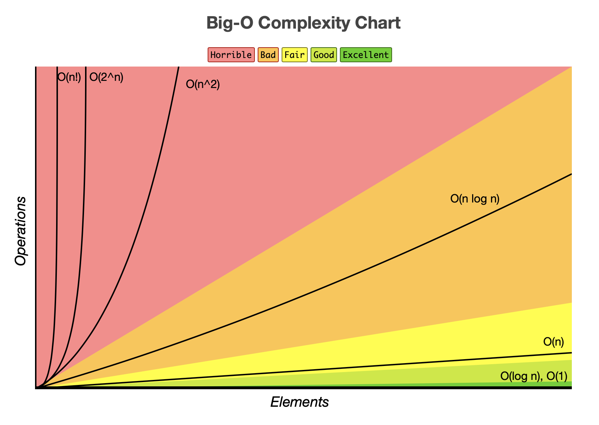
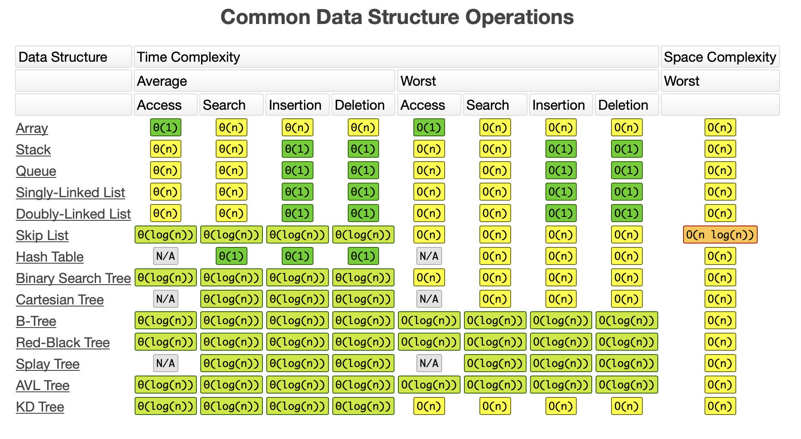
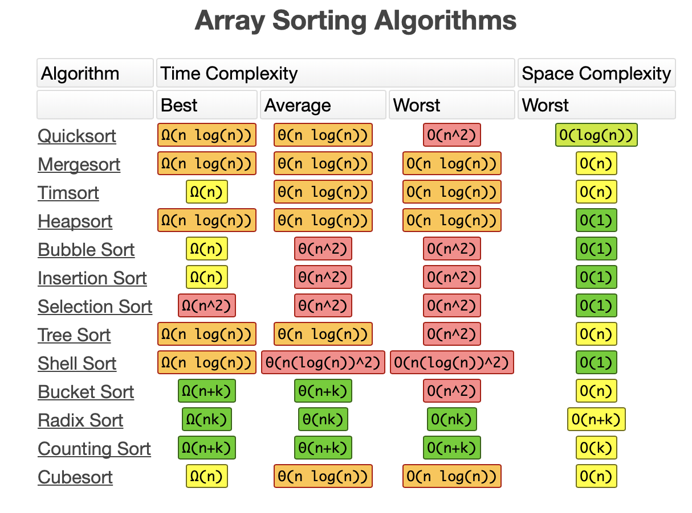

# Lab 04

## Notes

* This lab has taught about the Big-O complexities in a system. Now, to really rank them would be on a case by case scenario. Below are some cheet sheets and chats for the best, average, and worst case complexities for search and sorting algorithms. 

* In the comment section I was going to construct randomized arrays of one dimenesional and two dimensional but due to time constraits did not have time to get around to it. As well as include an implementation of the binary search method but in a matrix format. There is also a search algoritm in the comments that would have been a Fiboncci search algorithm for a linear array. I will not be finishing these functions but they are posted as notes for possible later implications.

* Regarding the lab specifically, we had two sepearte search algorithms which were sequential and binary. 

* In the sequential search, the worst case scenario will be that if the desired element was not in the array at all or that it was in the last possible index.

* In the binary search, the worst case scenario will be that if the desired element was not in the array at all or that it was perfectly in the last possible middle state when divided. 

* Please note, this depends are data stucture and the algorithm implmented. 

The link for a reference to more of the same as cheat sheet for future interviews is linked below as well. 

https://www.bigocheatsheet.com

If there are any questions or concerns, please let me know. 

